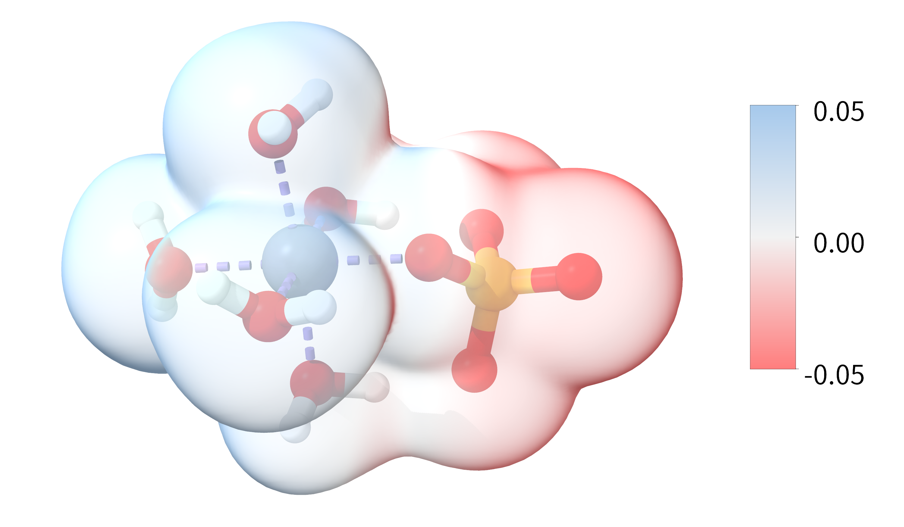
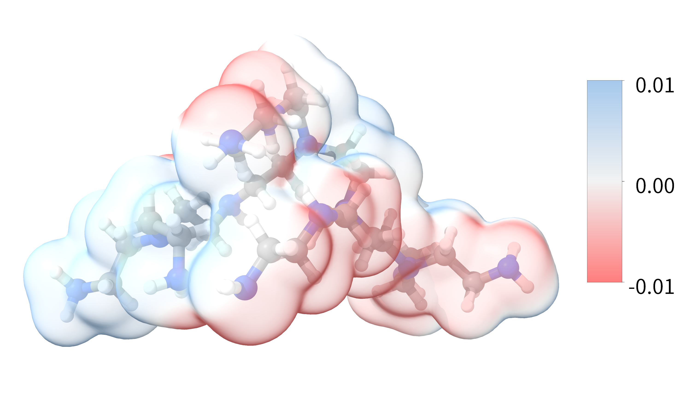

# About This Repository
**This repository contains all source profiles regarding our academic work, and here are two previews of this repository: **
 
 

# Citation:
**If anything of this repository is helpful on your academic research, we'll be definitely flattered. And we'd appreciate it if you could cite this work: **
***Coming Soon...***

# Acknowledgements:
**[1] The ESP values related to this repository were calculated by the mep.py script developed by Dr. Marius Retegan (Available at: https://gist.github.com/mretegan/5501553). We genuinely express our greatest gratitude to Dr. Marius Retegan! **
**[2] All forcefiled files contained in this repository have been properly cited in our work and feel free to read our paper. We genuinely express our greatest gratitude to all the developers! **
